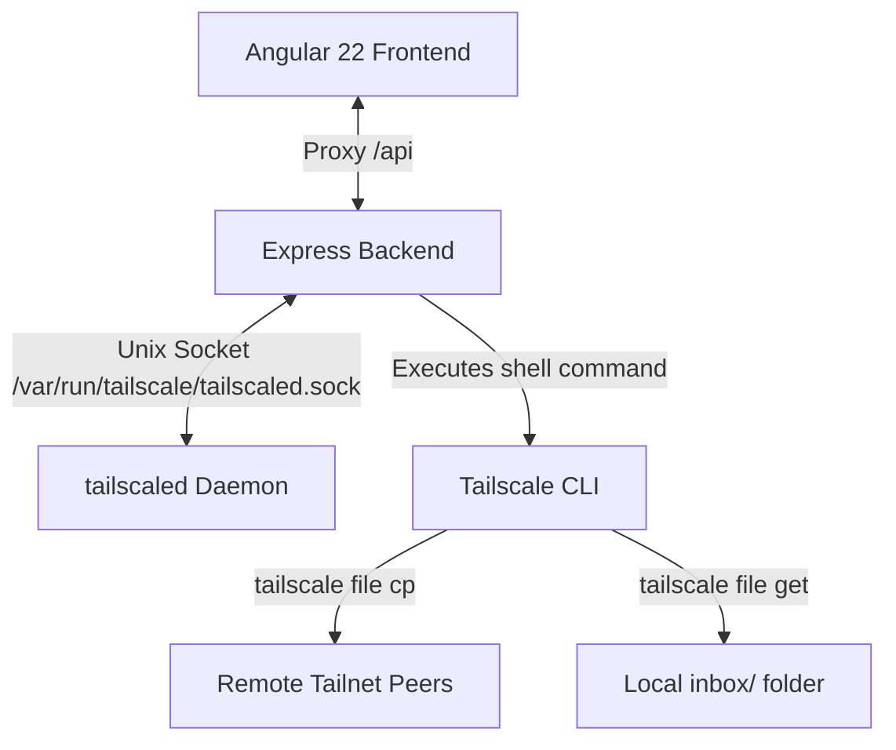

# Taildrop Transfer Web Application

A beautiful, dark-themed, glassmorphic web application built with **Angular 22** and a **Node.js Express** backend to manage file transfers (Taildrop) to other devices on your Tailscale network.

## System Architecture



1. **Frontend (Angular 22)**: Designed with a modern, glassmorphic dark-theme and built reactive states using Angular Signals. It provides a real-time list of network peers, drag-and-drop file upload capabilities, and an inbox manager for received files.
2. **Backend (Express)**: Exposes endpoints to check status, upload/send files, and retrieve/list local files.
   - **Unix Socket Integration**: Communicates directly with the `tailscaled` daemon socket at `/var/run/tailscale/tailscaled.sock` using Node's `http` client to fetch status (`/localapi/v0/status`) and peer candidates (`/localapi/v0/file-targets`).
   - **Taildrop Actions**: Spawns secure, non-shell executions of `tailscale file cp` to transfer files and `tailscale file get` to pull files into the application directory.
3. **Local Staging**: Files received on this device are stored in the `./received/` folder, from which they can be downloaded or deleted via the UI.

---

## Features

- **Automatic Device Discovery**: Live listing of all devices connected to your Tailnet, styled with active OS badges (Apple, Windows, Android, Linux, etc.) and online/offline status indicators.
- **Drag-and-Drop File Sender**: A fluid drag-and-drop workspace that allows you to easily stage and send any file to a target device via Taildrop.
- **Taildrop Inbox Management**: A dedicated section to check for incoming files sent from your other devices, complete with manual/auto sync, file details, browser download triggers, and file deletion.
- **Premium Glassmorphic Design**: Curated dark UI with responsive grids, interactive focus styles, and animated loading skeletons.

---

## Getting Started

### Prerequisites

- **Tailscale**: Tailscale must be installed and active on the host machine.
- **Node.js**: Node.js and npm installed.

### Installation

1. Navigate to the project folder (if not already there):
   ```bash
   cd /home/nimesh/Documents/projects/taildrop-transfer-app
   ```

2. Install dependencies:
   ```bash
   npm install
   ```

### Running the Application

To start both the Angular development server and the Express backend concurrently:

```bash
npm run dev
```

This will run:
- **Angular Dev Server** at [http://localhost:4200](http://localhost:4200) (linked via proxy configuration)
- **Express Backend** at [http://localhost:3000](http://localhost:3000)

Open [http://localhost:4200](http://localhost:4200) in your browser to start transferring files.

### Standard Scripts

- `npm run dev`: Run both frontend and backend concurrently in development mode.
- `npm run start`: Serve only the Angular dev server (port 4200).
- `npm run server`: Run only the Express backend server (port 3000).
- `npm run build`: Compile the Angular application for production (output to `dist/taildrop-app/`).

---

## Project Structure

- `src/app/app.ts` - Main Angular application component.
- `src/app/app.html` - App interface template.
- `src/app/app.css` - Component-specific styles.
- `src/app/taildrop.service.ts` - Angular HTTP service wrapper.
- `src/app/app.config.ts` - App configuration (HTTP and Router providers).
- `server/server.js` - Express backend.
- `proxy.conf.json` - Proxy configuration for the Angular dev-server.
- `received/` - Directory where received Taildrop files are stored.
- `uploads/` - Directory used for staging temporary file transfers.

---

## Docker Deployment

You can build and deploy the entire application as a single, lightweight Docker container, either via the Docker CLI or using Docker Compose.

### Method A: Using Docker Compose (Recommended)

1. Start the application in the background and build the image:
   ```bash
   docker compose up -d --build
   ```
2. Once running, open your browser and navigate to [http://localhost:3000](http://localhost:3000).

To stop and remove the container, run:
```bash
docker compose down
```

---

### Method B: Using Docker CLI

1. **Build the Docker Image**:
   ```bash
   docker build -t taildrop-transfer-app .
   ```

2. **Run the Container**:
   ```bash
   docker run -d \
     --name taildrop-app \
     -p 3000:3000 \
     -v /var/run/tailscale/tailscaled.sock:/var/run/tailscale/tailscaled.sock \
     -v ~/Downloads/Taildrop:/app/received \
     taildrop-transfer-app
   ```

#### Volume & Port Configurations:
*   `3000:3000`: Binds the app interface and API to port `3000` on your host.
*   `/var/run/tailscale/tailscaled.sock:/var/run/tailscale/tailscaled.sock`: Mounts the host's Tailscale daemon socket. The `tailscale` CLI inside the container will use this connection, allowing it to perform P2P transfers using your host's Tailscale identity.
*   `~/Downloads/Taildrop:/app/received`: Maps files received via Taildrop directly into your host's `~/Downloads/Taildrop` directory, making them immediately accessible.

Once running, navigate to [http://localhost:3000](http://localhost:3000) to access the app.

