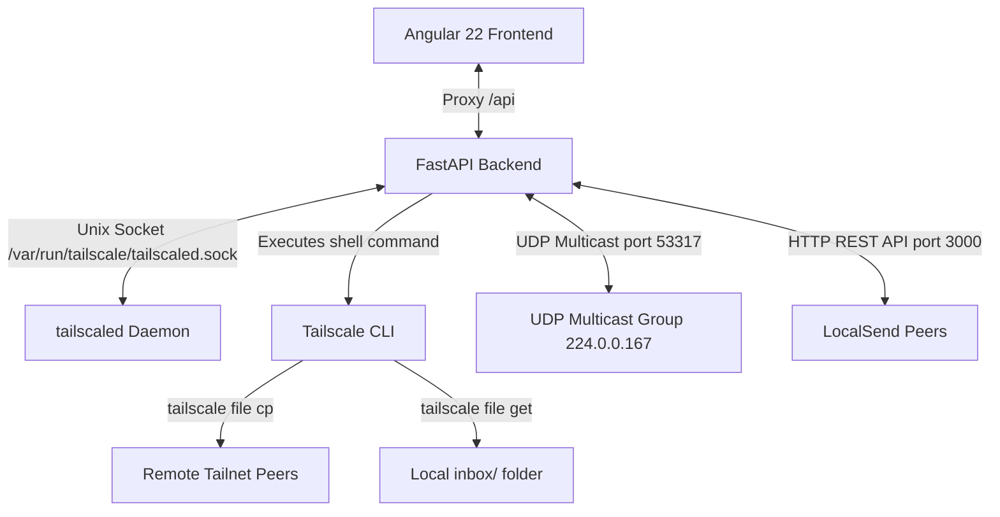

# MultiDrop Transfer Web Application

A beautiful, dark-themed, glassmorphic web application built with **Angular 22** and a **Python FastAPI** backend to manage file transfers to other devices on your Tailscale network (Taildrop) and local Wi-Fi network (LocalSend).

## System Architecture



1. **Frontend (Angular 22)**: Designed with a modern, glassmorphic dark-theme and built reactive states using Angular Signals. It provides a real-time list of network peers, drag-and-drop file upload capabilities, an inbox manager for received files, and dynamic buttons/labels indicating the transfer mode (Taildrop vs. LocalSend).
2. **Backend (Python FastAPI)**: Exposes endpoints to check status, upload/send files, retrieve/list local files, and handles LocalSend API handshakes.
   - **Unix Socket Integration**: Communicates directly with the `tailscaled` daemon socket at `/var/run/tailscale/tailscaled.sock` using `httpx` to fetch status (`/localapi/v0/status`) and peer candidates (`/localapi/v0/file-targets`), setting correct host headers (`Host: local-tailscaled.sock`).
   - **Taildrop Actions**: Spawns secure, non-shell executions of `tailscale file cp` to transfer files and `tailscale file get` to pull files.
   - **LocalSend Integration**: Listens on UDP port `53317` for multicast announcements (`224.0.0.167`) to discover local devices and implements LocalSend REST API V2 endpoints (`/info`, `/register`, `/prepare-upload`, and `/upload`) to coordinate transfers.
3. **Local Staging**: Files received on this device are stored in the `./received/` folder, from which they can be downloaded or deleted via the UI.

---

## Features

- **Multi-Protocol Transfers**: Seamlessly supports both Tailscale (Taildrop) and local Wi-Fi peer-to-peer sharing (LocalSend Protocol V2).
- **Automatic Device Discovery**: Live listing of all devices connected to your Tailnet or Local Wi-Fi network, styled with active OS badges (Apple, Windows, Android, Linux, etc.) and online/offline status indicators.
- **Drag-and-Drop File Sender**: A fluid drag-and-drop workspace that allows you to easily stage and send files.
- **Persistent Inbox Management**: A dedicated section to check for incoming files sent from other devices, complete with manual/auto sync, file details, browser download triggers, archive zip extraction on the server, and file deletion.
- **Smart Notification System**: Browser notifications and audio chimes for received files that can be toggled on/off in the UI, persisting preference to `localStorage`.
- **Premium Glassmorphic Design**: Curated dark UI with responsive grids, interactive focus styles, and animated loading skeletons.

---

## Getting Started

### Prerequisites

- **Tailscale**: Tailscale must be installed and active on the host machine.
- **Python 3**: Python 3.10+ and `venv` module installed.
- **Node.js**: Node.js and npm installed for compiling the Angular frontend.

### Installation

1. Navigate to the project folder (if not already there):
   ```bash
   cd /home/nimesh/Documents/projects/taildrop-transfer-app
   ```

2. Setup python virtual environment and install backend dependencies:
   ```bash
   python3 -m venv .venv
   .venv/bin/pip install -r requirements.txt
   ```

3. Install frontend node modules:
   ```bash
   npm install
   ```

### Running the Application

To start both the Angular development server and the Python FastAPI backend concurrently:

```bash
npm run dev
```

This will run:
- **Angular Dev Server** at [http://localhost:4200](http://localhost:4200) (linked via proxy configuration)
- **FastAPI Backend** at [http://localhost:3000](http://localhost:3000) using uvicorn.

Open [http://localhost:4200](http://localhost:4200) in your browser to start transferring files.

### Standard Scripts

- `npm run dev`: Run both frontend and backend concurrently in development mode.
- `npm run start`: Serve only the Angular dev server (port 4200).
- `npm run server`: Run only the FastAPI backend server (port 3000).
- `npm run build`: Compile the Angular application for production (output to `dist/taildrop-app/`).
- `npm test`: Run the Angular frontend tests.

---

## Running Unit Tests

The backend includes a comprehensive unit test suite written in `pytest` to test status parsing, ping latencies, and LocalSend uploads/handshakes.

To run the Python unit test suite:
```bash
.venv/bin/pytest tests/test_main.py
```

---

## Project Structure

- `src/app/app.ts` - Main Angular application component.
- `src/app/app.html` - App interface template.
- `src/app/app.css` - Component-specific styles.
- `src/app/taildrop.service.ts` - Angular HTTP service wrapper.
- `server/main.py` - FastAPI backend.
- `requirements.txt` - Python backend and testing dependencies.
- `tests/test_main.py` - Python FastAPI unit tests.
- `proxy.conf.json` - Proxy configuration for the Angular dev-server.
- `received/` - Directory where received files are stored.
- `uploads/` - Directory used for staging temporary file transfers.

---

## Docker Deployment

You can build and deploy the entire application as a single, lightweight Docker container, using Docker Compose.

### Running with Docker Compose (Recommended)

Because LocalSend relies on UDP Multicast for network discovery, the Docker container must run in `host` networking mode.

1. Start the application in the background and build the image:
   ```bash
   docker compose up -d --build
   ```
2. Once running, open your browser and navigate to [http://localhost:3000](http://localhost:3000).

To stop and remove the container, run:
```bash
docker compose down
```

#### Volume & Port Configurations in Host Mode:
*   `network_mode: host`: Gives the container direct access to all host network interfaces. The app will bind to host ports `3000` (interface/API) and `53317` (LocalSend discovery).
*   `/var/run/tailscale/tailscaled.sock:/var/run/tailscale/tailscaled.sock`: Mounts the host's Tailscale daemon socket. The `tailscale` CLI inside the container will use this connection, allowing it to perform P2P transfers using your host's Tailscale identity.
*   `~/Downloads/Taildrop:/app/received`: Maps files received via transfers directly into your host's `~/Downloads/Taildrop` directory, making them immediately accessible.
