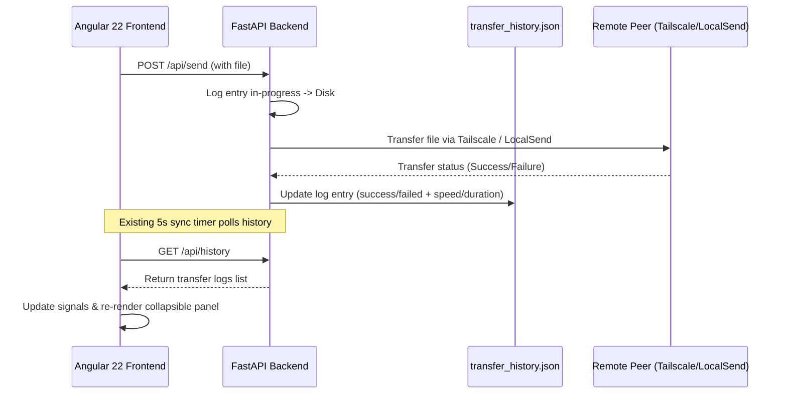

# Design Spec: Transfer History & Logging

A complete design specification for tracking, persisting, and displaying historical file transfers within the MultiDrop Transfer Web Application.

---

## 1. Objectives

- **Audit Trail**: Maintain a persistent historical record of all sent and received files, surviving application restarts.
- **Performance Diagnostics**: Log transfer speed (Bytes/second) and total duration for each completed transfer.
- **Error Visibility**: Clearly display error logs for failed transfers, helping diagnose connection/network issues.
- **Quick Retry**: Provide a frontend action to quickly re-queue and re-transfer previously failed or past items.

---

## 2. System Architecture & Data Flow



---

## 3. Detailed Specification

### 3.1 Data Schema (`transfer_history.json`)
The logs are persisted in a flat JSON array located in the project root as `transfer_history.json`.

```typescript
export interface TransferLog {
  id: string;          // Format: tx-timestamp-random (e.g. "tx-1706000000123")
  filename: string;    // Original file name
  size: number;        // Size in bytes
  direction: 'send' | 'receive';
  peerId: string;      // ID of peer (e.g. "localsend-abc" or Tailscale node ID)
  peerName: string;    // Human-readable peer computed name
  protocol: 'Taildrop' | 'LocalSend';
  status: 'success' | 'failed' | 'in-progress';
  timestamp: string;   // ISO 8601 UTC timestamp of transfer resolution
  speedBps?: number;   // Average speed in Bytes per second
  durationMs?: number; // Total duration in milliseconds
  errorMsg?: string;   // Verbose failure description if failed
}
```

### 3.2 Backend Endpoints ([main.py](file:///home/nimesh/Documents/projects/taildrop-transfer-app/server/main.py))

#### `GET /api/history`
- **Action**: Reads `transfer_history.json`.
- **Response**: List of `TransferLog` elements, sorted newest first. Returns `[]` if the file doesn't exist.

#### `POST /api/history/clear`
- **Action**: Clears history logs (truncates file to `[]`).
- **Response**: `{"success": true}`.

#### Helper: `log_transfer_event(...)`
- **Action**: A thread-safe file lock writer that appends or updates log entries.
- **Workflow**:
  1. Reads existing log file.
  2. Updates log entry matching target ID.
  3. Writes back to disk.

### 3.3 Frontend Integration ([app.ts](file:///home/nimesh/Documents/projects/taildrop-transfer-app/src/app/app.ts))

- **Signals**:
  - `protected readonly transferHistory = signal<TransferLog[]>([])`
  - `protected readonly isHistoryCollapsed = signal<boolean>(false)`
- **Data Fetch**:
  - `fetchHistory()` retrieves history from `/api/history`.
  - Added to initial `ngOnInit()` load and the 5-second `refreshData()` loop.

### 3.4 Collapsible UI Layout ([app.html](file:///home/nimesh/Documents/projects/taildrop-transfer-app/src/app/app.html))
- A new section `.history-section` is appended inside the right-hand `.workspace-section`, directly below the active transfer queue.
- Collapsing toggles the `isHistoryCollapsed()` signal, hiding the history table/list while keeping the card header visible.

### 3.5 Quick Retry Mechanism
- Clicking **Retry ↻** on a log entry triggers:
  1. Destination peer lookup: `selectedPeer.set(matchingPeer)`.
  2. A new `QueueItem` is inserted into `selectedFiles` with a placeholder status:
     `{ id, file: dummyFile, status: 'pending', message: 'Re-upload file to send' }`
  3. The app triggers the HTML file input click event to prompt the user to select the original file.
  4. Upon selection, the file queue updates and automatically executes the transfer.

---

## 4. Edge Cases & Error Handling

- **Concurrent Log Writes**: The Python backend will write to `transfer_history.json` using a thread-safe helper lock (`threading.Lock`) to prevent corruption from multiple overlapping transfers.
- **Corrupted JSON Recovery**: If reading `transfer_history.json` raises a JSON decoding error, the server will log the error, archive the corrupted file to `transfer_history.corrupted.json`, and start a fresh log list.
- **Offline Retry Target**: If a peer is offline during retry, the queue item transitions to `status: 'error'` with the message "Target device offline".

---

## 5. Test Plan

### Backend Unit Tests ([test_main.py](file:///home/nimesh/Documents/projects/taildrop-transfer-app/tests/test_main.py))
- Test file initialization and log generation.
- Test log retrieval via `GET /api/history`.
- Test history clearing via `POST /api/history/clear`.
- Verify calculated speeds and status updates for simulated LocalSend uploads.

### Frontend Integration Tests
- Verify signal updates when history is polled.
- Test collapsible click interactions.
- Mock the file upload retry flow.
