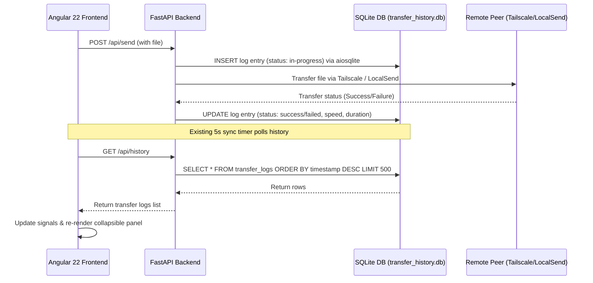

# Design Spec: Transfer History & Logging (SQLite Architecture)

A complete design specification for tracking, persisting, and displaying historical file transfers within the MultiDrop Transfer Web Application using an async SQLite database.

---

## 1. Objectives

- **Audit Trail**: Maintain a persistent historical record of all sent and received files, surviving application restarts.
- **Concurrent Safety**: Safely handle concurrent transfer writes and status updates across multiple Uvicorn workers without locks or race conditions.
- **Performance Diagnostics**: Log transfer speed (Bytes/second) and total duration for each completed transfer without blocking FastAPI's async event loop.
- **Error Visibility**: Clearly display error logs for failed transfers, helping diagnose connection/network issues.
- **Quick Retry**: Provide a frontend action to quickly re-queue and re-transfer previously failed or past items, with filename and size validation checks.

---

## 2. System Architecture & Data Flow



---

## 3. Detailed Specification

### 3.1 Persistence Layer: SQLite Schema (`transfer_history.db`)
We will use a local SQLite database file in the workspace directory. We will configure it with **Write-Ahead Logging (WAL)** mode for concurrent read/write support.

```sql
CREATE TABLE IF NOT EXISTS transfer_logs (
    id TEXT PRIMARY KEY,
    filename TEXT NOT NULL,          -- Sanitized base filename (no directory traversal, no full paths)
    size INTEGER NOT NULL,           -- File size in bytes
    direction TEXT CHECK(direction IN ('send', 'receive')) NOT NULL,
    peer_id TEXT NOT NULL,           -- Unique identifier of the remote peer
    peer_name TEXT NOT NULL,         -- Friendly name of the remote peer
    protocol TEXT CHECK(protocol IN ('Taildrop', 'LocalSend')) NOT NULL,
    status TEXT CHECK(status IN ('success', 'failed', 'in-progress')) NOT NULL,
    timestamp TEXT NOT NULL,         -- ISO 8601 UTC timestamp of creation
    speed_bps REAL,                  -- Calculated speed in Bytes/sec
    duration_ms INTEGER,             -- Duration of transfer in milliseconds
    error_msg TEXT                   -- Error message if failed
);
```

### 3.2 Backend Endpoints ([main.py](file:///home/nimesh/Documents/projects/taildrop-transfer-app/server/main.py))

We will use the standard `aiosqlite` package for async database interaction, preventing blocking call issues in the event loop.

#### `GET /api/history`
- **Query**: `SELECT * FROM transfer_logs ORDER BY timestamp DESC LIMIT 500`
- **Response**: List of transfer logs.

#### `POST /api/history/clear`
- **Query**: `DELETE FROM transfer_logs`
- **Response**: `{"success": true}`

#### Logging Helper: `async def log_transfer_event(log: TransferLog)`
- **Inserts or updates** the log entry.
- **Auto-prunes history** to keep only the last 500 entries, preventing disk/memory bloat:
  ```sql
  DELETE FROM transfer_logs WHERE id NOT IN (
      SELECT id FROM transfer_logs ORDER BY timestamp DESC LIMIT 500
  );
  ```

---

## 4. Frontend Integration ([app.ts](file:///home/nimesh/Documents/projects/taildrop-transfer-app/src/app/app.ts))

### 4.1 Signals
- `protected readonly transferHistory = signal<TransferLog[]>([])`
- `protected readonly isHistoryCollapsed = signal<boolean>(false)`

### 4.2 Polling Updates
- `fetchHistory()` queries `/api/history` and updates `transferHistory`.
- Hooked into `ngOnInit()` and the 5-second `refreshData()` sync loop.

### 4.3 Collapsible Layout ([app.html](file:///home/nimesh/Documents/projects/taildrop-transfer-app/src/app/app.html))
- Rendered as a collapsible bottom panel `.history-section` directly within the workspace card, preserving active queue visibility.

### 4.4 Refined Retry Workflow
Clicking **Retry ↻** on a historical log triggers a safe client-side re-upload sequence:
1. **Peer Validation**: The app checks if the destination peer is online (`peer.online === true` and present in the peer list). If the peer is offline, the retry button is disabled, or a toast warns the user.
2. **File Selection**: The app launches the browser file picker dialog *before* modifying the transfer queue.
3. **Frontend Validation**: When the user selects a file:
   - Verify `selectedFile.name === log.filename`
   - Verify `selectedFile.size === log.size`
   - If they do not match, show an error alert and abort.
4. **Queue Insertion**: Only if validation passes, select the target peer (`selectedPeer.set(...)`), add the file to `selectedFiles` with status `'pending'`, and trigger the transfer queue.

---

## 5. Security & Edge Cases

- **Path Traversal Protection**: The backend will sanitize filenames using `os.path.basename(file.filename)` before storing them in the database or saving files to the directory.
- **Absolute Path Sanitization**: Full source paths are discarded; only base filenames are logged.
- **WAL Mode Activation**: Startup logic executes `PRAGMA journal_mode=WAL;` to guarantee readers are not blocked by active writes.
- **Dependency installation**: We will add `aiosqlite` to `requirements.txt`.

---

## 6. Test Plan

### Backend Unit Tests ([test_main.py](file:///home/nimesh/Documents/projects/taildrop-transfer-app/tests/test_main.py))
- Test database initialization and schema creation.
- Test `log_transfer_event` under concurrent asynchronous tasks.
- Test endpoint listing limit (assert max 500 rows returned).
- Test history truncation.

### Frontend Integration Tests
- Verify file name and size validation before queuing a retry.
- Verify collapsible panel toggles.
